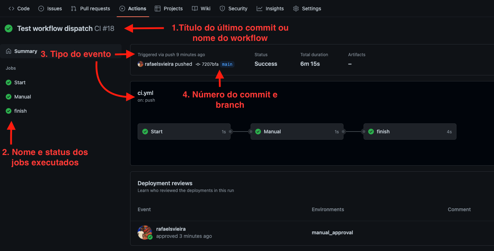
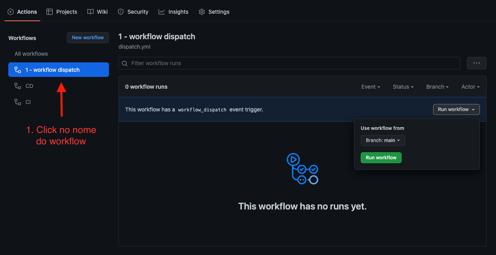

# Workflows

Os workflows são as pipelines do projeto, então podem conter fluxos de build, teste, gate, validações, deploys, etc. Os workflows são arquvios YAML e sempre ficam contidos no caminho `.github/workflows/`. Podemos ter multiplos workflows dentro de um repositório. O workflow contém algumas propriedades como `name` (nome), `on` (eventos), `jobs` (execuções) e `outputs` (saídas).

Os eventos são peças essenciais para definirmos em que momento o workflow será executado. Há dezenas de formas de iniciar um workflow, porém nesse hands-on iremos focar em apenas 3 eventos.

O histórico de execução dos workflows ficam contidos na aba Actions do repositório. A imagem abaixo sinaliza algumas informações relevantes exibidas em uma execução.



## 1. push

O primeiro evento que iremos ver é o de `push`. Significa que toda e qualquer alteração de código que aconteça no repositório ou em alguma branch específica (filtro) um workflow pode ser iniciado.

```yaml
name: '1. Only push'

on:
  push:

jobs:
  push-trigger:
    name: My job
    runs-on: ubuntu-latest
    steps:
      - name: Trigger
        run: echo "Push trigger"
```

O exemplo descrito acima, mostra que todo e qualquer push, independente da branch, irá iniciar o workflow `1. Only push`.

Porém nem sempre queremos iniciar um workflow com um push no repositório. Não é interessante fazer um deploy enquanto estamos desenvolvemento uma feature. Para contornar isso há a funcionalidade de filtros, como `branches`, `paths`, `tags`, etc. Com isso conseguimos restrigir em que momento iremos iniciar o workflow.

```yaml
name: '1. push with filters'

on:
  push:
    branches:
      - 'releases/**'
    paths:
      - '**.js'

jobs:
  push-filter:
    name: My job
    runs-on: ubuntu-latest
    steps:
      - name: Trigger
        run: echo "Push trigger with filters"
```

O workflow descrito acima está sendo utilizado dois filtros e só irá iniciar com um push em uma branch que inicia com release/ e caso o push contenha um arquivo com extensão js.

## 2. workflow_dispatch

O `workflow_dispatch` diferente do evento do push, não está atrelado a uma alteração no repositório. É um evento que necessita de uma requisição externa ao repositório via API ou na aba de Actions pelo navegador.


```yaml
name: '2. workflow dispatch'

on:
  workflow_dispatch:

jobs:
  dispatch:
    name: My job with dispatch
    runs-on: ubuntu-latest
    steps:
      - name: Trigger
        run: echo "Workflow dispatch"
```

Para executar um workflow dispatch basta selecionar o nome do workflow e depois Run workflow.



O workflow_dispatch tem uma propriedade importante, o `inputs`. Através dele podemos passar parâmetros para o nosso workflow.

```yaml
name: '2. workflow dispatch with parameters'

on:
  workflow_dispatch:
    inputs:
      text:
        description: 'Type a word'
        required: true
        type: string

jobs:
  dispatch:
    name: My job with dispatch
    runs-on: ubuntu-latest
    steps:
      - name: Trigger
        run: echo "Workflow dispatch received ${{ inputs.text }}"
```

Os inputs podem ser do tipo string, choice, boolean ou environment.


Mais informações sobre workflows basta acessar a [documentação](https://docs.github.com/en/actions/using-workflows/about-workflows) oficial.


[Sumário](../README.md) | [Jobs](../Jobs/README.md)